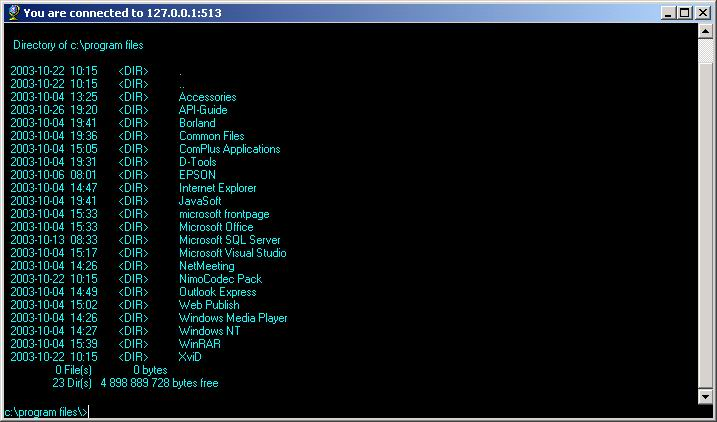



## CMDServer and Client,  Remote Execution, Termination and CMD Interpreter

### Description

CMDServer is a Server that you can connect with CMDClient to perform Remote Execution,

Remote Termination of processes and most tasks in the Command Interpreter.

CMDServer can only run on NT Systems (NT,Win2K,XP)

Due to the user validation the server does on remote connection attempts, the server must

run on a machine there the loggedin user has adminstrative rights.

Use CMDClient from any computer that can reach CMDServer to perform all

Commands available from the commandprompt and those listed below

CONNECT IP/Host[:Port] (Connect to CMDServer on Port = 512)

EXIT (Close connection)

REXIT (Close down cmdServer)

CMDHELP (Show this help)

GETRUNAPP (Show running apps)

REXEC [FullPath/]Filename.ext [parameters] (Execute remote application)

RTERM HWND (Close running app)

CLS (Clear Screen)

When a user want to make a remote connection to the server the user will be prompt for

Username and password, the user most have administrator rights on the server.

OBSERVE that if you remotly start an application via cmd the server will not return until

the application is terminated.

Use REXEC instead

This is a stripdown version of what I am currently developing for my work that is running as a NT Service among other things...

Huge credit goes to Mattias Sjögren for the command interpreter part, I also has got big help from www.allapi.com, the people here on PSC. Thank you all :-)

constructive feedback is always welcome. It helps me grow as a developer :-)
 
### More Info
 

             |
---                |---
**Submitted On**   |2003-10-24 21:52:56
**By**             |[Knoton](https://github.com/Planet-Source-Code/PSCIndex/blob/master/ByAuthor/knoton.md)
**Level**          |Intermediate
**User Rating**    |5.0 (30 globes from 6 users)
**Compatibility**  |VB 6\.0
**Category**       |[Complete Applications](https://github.com/Planet-Source-Code/PSCIndex/blob/master/ByCategory/complete-applications__1-27.md)
**World**          |[Visual Basic](https://github.com/Planet-Source-Code/PSCIndex/blob/master/ByWorld/visual-basic.md)
**Archive File**   |[CMDServer\_16641710282003\.zip](https://github.com/Planet-Source-Code/knoton-cmdserver-and-client-remote-execution-termination-and-cmd-interpreter__1-49490/archive/master.zip)

